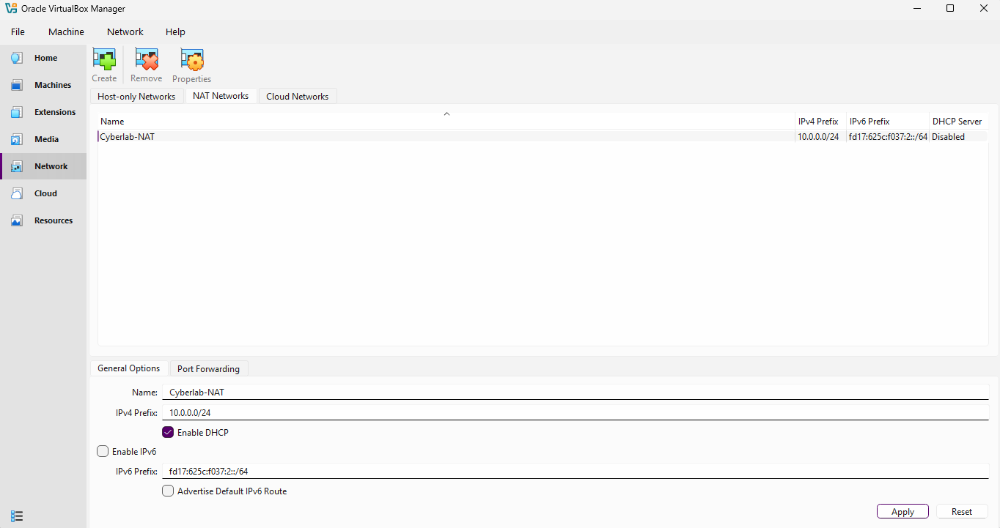
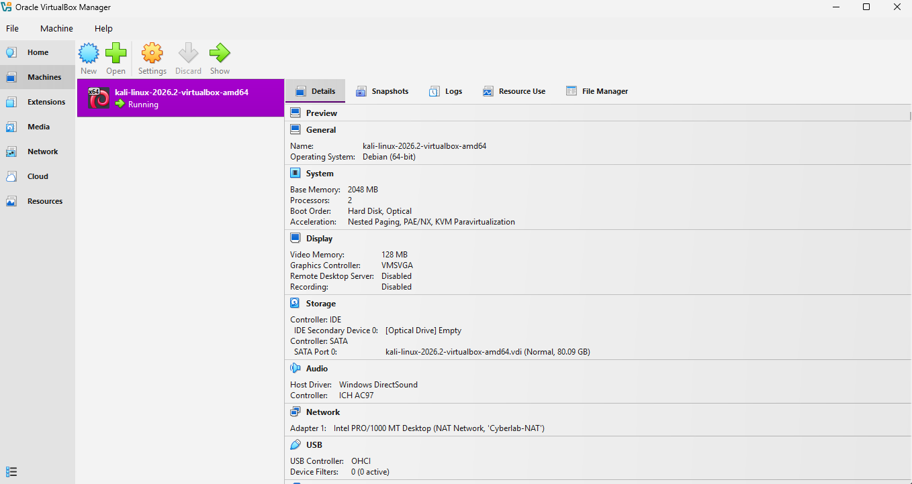
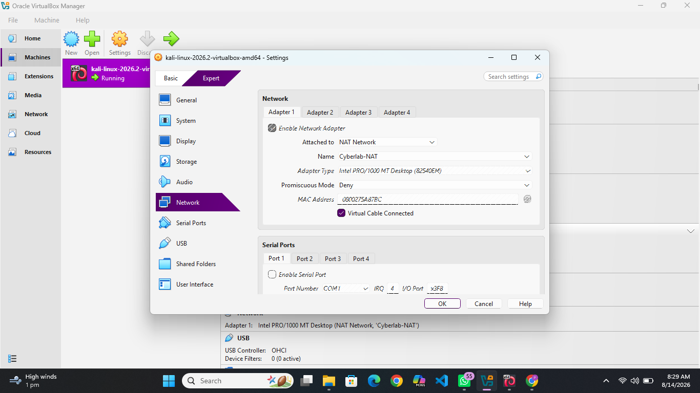
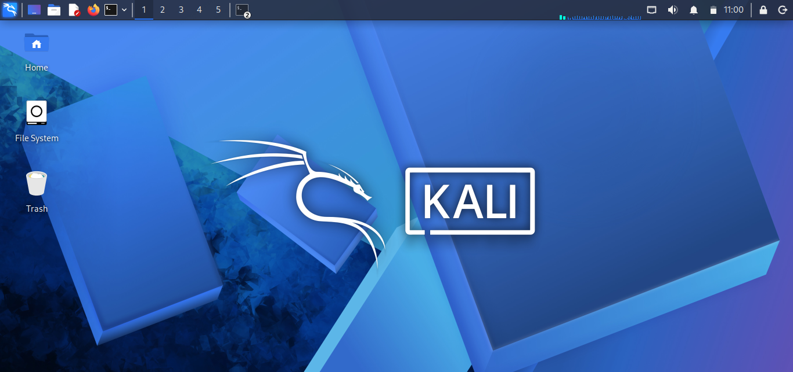
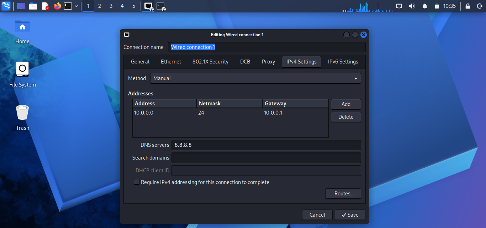
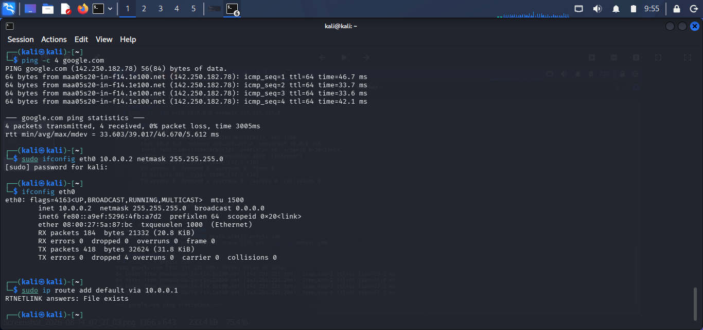
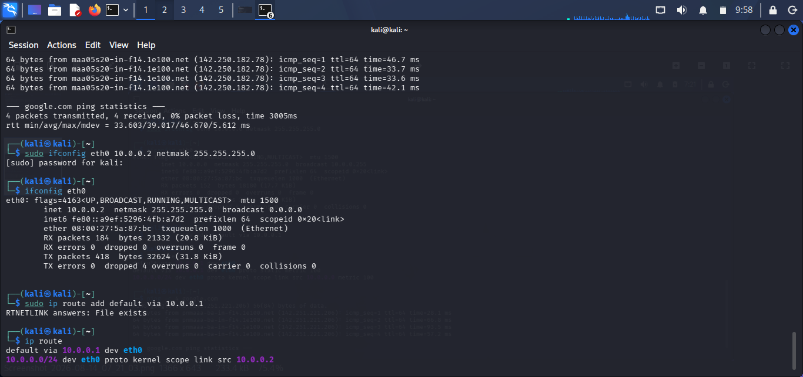

# Cybersecurity Lab Setup – Week 1

Objective

This lab demonstrates the setup and verification of a Kali Linux virtual machine using Oracle VirtualBox and a NAT Network. The network configuration was manually configured and verified using Linux networking commands.

---

 Step 1 – Create CyberLab NAT Network

A NAT Network named **CyberLab-NAT** was created in Oracle VirtualBox.

The network was configured with the IPv4 network:

`10.0.0.0/24`

DHCP was disabled so that the Kali Linux machine could be configured with a static IP address.

---

 Step 2 – Start Kali Linux Virtual Machine

The Kali Linux virtual machine was started in Oracle VirtualBox.

---

 Step 3 – Attach Kali Linux to the NAT Network

The Kali Linux virtual machine's network adapter was configured as:

- Attached to: **NAT Network**
- Network Name: **CyberLab-NAT**
- Virtual Cable Connected: Enabled

---

Step 4 – Access the Kali Linux Desktop

After starting the virtual machine, the Kali Linux desktop was successfully accessed.

---

 Step 5 – Configure the Wired IPv4 Connection

The wired network connection was configured manually using the following IPv4 settings:

- IP Address: `10.0.0.2`
- Netmask: `255.255.255.0` (`/24`)
- Gateway: `10.0.0.1`
- DNS Server: `8.8.8.8`

The connection was configured using the **Manual** IPv4 method.

---
# Step 6 – Configure and Test the Network

The following commands were executed in the Kali Linux terminal to configure and test the network connection.

The network connectivity and interface configuration were verified using the following commands:

`ping -c 4 google.com`

`sudo ifconfig eth0 10.0.0.2 netmask 255.255.255.0`

`ifconfig eth0`

`sudo ip route add default via 10.0.0.1`

---

# Step 7 – Verify the IP Routing Table

The final IP address and routing configuration were verified using the `ip route` command.

The system was found to have the IP address:

`10.0.0.2`

The default gateway was:

`10.0.0.1`

The following command was used to verify the final routing table:

`ip route`

